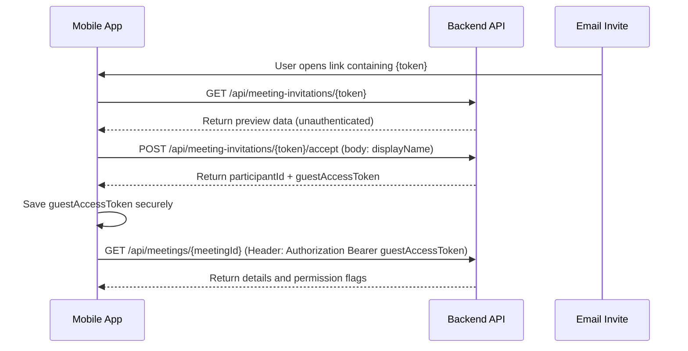
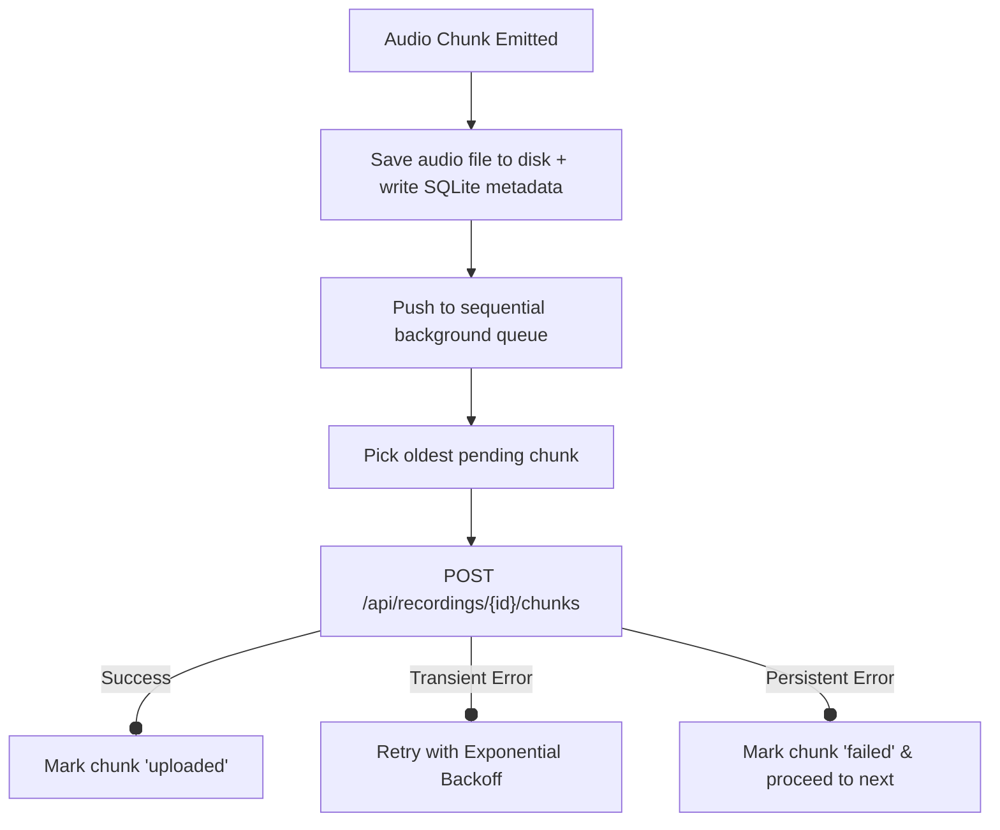

  # Meeting APIs Specification Document

This document provides a comprehensive technical reference for the **Live Meeting** APIs. It details all endpoints, request shapes, response shapes, optional parameters, and descriptions for each operation's purpose and role in the meeting lifecycle.

---

## 1. Global Specifications

### 1.1 Common Response Envelope
All API responses are wrapped in a generic standard `ApiResponse<T>` envelope structure:

```json
{
  "isSuccess": true,
  "statusCode": 200,
  "message": "ok",
  "data": null,
  "errors": []
}
```

* **`isSuccess`** (boolean): Indicates whether the request succeeded.
* **`statusCode`** (number): The HTTP response status code (e.g., `200`, `201`, `400`, `409`, etc.).
* **`message`** (string): A short, human-readable description of the operation result.
* **`data`** (`T` | `null`): The payload of the response containing the actual payload object or array.
* **`errors`** (array): Contains validation, application, or business logic errors if the request fails.

---

### 1.2 Shared String-Union Enums

* **`MeetingStatus`**: `"SCHEDULED"` | `"LIVE"` | `"ENDED"` | `"CANCELLED"`
* **`InvitationStatus`**: `"PENDING"` | `"ACCEPTED"` | `"DECLINED"` | `"EXPIRED"` | `"REVOKED"`
* **`InviteeType`**: `"PROJECT_MEMBER"` | `"STAKEHOLDER"` | `"GUEST"`
* **`MeetingRole`**: `"HOST"` | `"PARTICIPANT"` | `"VIEWER"`
* **`ParticipantStatus`**: `"JOINED"` | `"LEFT"` | `"REMOVED"`
* **`RecordingStatus`**: `"ACTIVE"` | `"STOPPED"` | `"FINALIZING"` | `"READY"` | `"FAILED"` | `"EXPIRED"`
* **`UploadMode`**: `"SINGLE_FILE"` | `"CHUNKED"`

---

## 2. API Operations Index

| # | Operation | Method & Endpoint | Auth Required |
|---|---|---|---|
| 1 | [Search Project Members](#1-search-project-members) | `GET /api/projects/{projectId}/members` | Yes (Host Bearer) |
| 2 | [List Project Meetings](#2-list-project-meetings) | `GET /api/projects/{projectId}/meetings` | Yes (Bearer) |
| 3 | [Create Meeting](#3-create-meeting) | `POST /api/projects/{projectId}/meetings` | Yes (Bearer) |
| 4 | [Get Meeting Details](#4-get-meeting-details) | `GET /api/meetings/{meetingId}` | Yes (Bearer) |
| 5 | [Update Meeting Details](#5-update-meeting-details) | `PATCH /api/meetings/{meetingId}` | Yes (Host Bearer) |
| 6 | [Cancel Meeting](#6-cancel-meeting) | `POST /api/meetings/{meetingId}/cancel` | Yes (Host Bearer) |
| 7 | [Invite Project Members](#7-invite-project-members) | `POST /api/meetings/{meetingId}/invitations/participants` | Yes (Host Bearer) |
| 8 | [Invite External Guests](#8-invite-external-guests) | `POST /api/meetings/{meetingId}/invitations/guests` | Yes (Host Bearer) |
| 9 | [Get Meeting Invitations](#9-get-meeting-invitations) | `GET /api/meetings/{meetingId}/invitations` | Yes (Bearer) |
| 10 | [Resend Invitation](#10-resend-invitation) | `POST /api/meetings/{meetingId}/invitations/{invitationId}/resend` | Yes (Host Bearer) |
| 11 | [Revoke Invitation](#11-revoke-invitation) | `DELETE /api/meetings/{meetingId}/invitations/{invitationId}` | Yes (Host Bearer) |
| 12 | [Preview Invitation](#12-preview-invitation) | `GET /api/meeting-invitations/{token}` | No (Public) |
| 13 | [Accept Invitation](#13-accept-invitation) | `POST /api/meeting-invitations/{token}/accept` | Conditional (Guest = No, Member = Yes) |
| 14 | [Join Meeting](#14-join-meeting) | `POST /api/meetings/{meetingId}/join` | Yes (Bearer or Guest token) |
| 15 | [Leave Meeting](#15-leave-meeting) | `POST /api/meetings/{meetingId}/leave` | Yes (Bearer or Guest token) |
| 16 | [Start Meeting](#16-start-meeting) | `POST /api/meetings/{meetingId}/start` | Yes (Host Bearer) |
| 17 | [End Meeting](#17-end-meeting) | `POST /api/meetings/{meetingId}/end` | Yes (Host Bearer) |
| 18 | [Get Meeting Participants](#18-get-meeting-participants) | `GET /api/meetings/{meetingId}/participants` | Yes (Bearer or Guest token) |
| 19 | [Remove Participant](#19-remove-participant) | `DELETE /api/meetings/{meetingId}/participants/{participantId}` | Yes (Host Bearer) |
| 20 | [Save Participant Consent](#20-save-participant-consent) | `POST /api/meetings/{meetingId}/participants/{participantId}/consent` | Yes (Bearer or Guest token) |
| 21 | [Start Recording](#21-start-recording) | `POST /api/meetings/{meetingId}/recordings/start` | Yes (Host Bearer) |
| 22 | [Upload Recording Chunk](#22-upload-recording-chunk) | `POST /api/recordings/{recordingId}/chunks` | Yes (Host Bearer) |
| 23 | [Upload Single Recording File](#23-upload-single-recording-file) | `POST /api/recordings/{recordingId}/file` | Yes (Host Bearer) |
| 24 | [Stop & Finalize Recording](#24-stop--finalize-recording) | `POST /api/recordings/{recordingId}/stop` | Yes (Host Bearer) |
| 25 | [Get Recording Status](#25-get-recording-status) | `GET /api/recordings/{recordingId}` | Yes (Bearer or Guest token) |

---

## 3. Detailed API Endpoint Specifications

### 1. Search Project Members
* **Use Case**: Used by the meeting host to search and select members/stakeholders within a project in order to add them to the invitation list.
* **HTTP Method**: `GET`
* **URL Path**: `/api/projects/{projectId}/members`
* **Query Parameters**:
  * `Search` (string, optional) - Filters members by name/email match.
  * `PageNumber` (integer, optional) - Page index for pagination (starts at 1).
  * `PageSize` (integer, optional) - Number of results per page.
* **Request Body**: None
* **Success Response (200 OK)**:
  ```json
  {
    "isSuccess": true,
    "statusCode": 200,
    "message": "ok",
    "data": {
      "items": [
        {
          "userId": "usr-12345",
          "name": "Hassan Abdelhamed",
          "email": "hassan@example.com",
          "projectRole": "STAKEHOLDER",
          "avatarUrl": "https://cdn.avatar.com/hassan.jpg" 
        }
      ],
      "totalCount": 1,
      "pageNumber": 1,
      "pageSize": 20
    },
    "errors": []
  }
  ```
  *(Note: `avatarUrl` is optional and can be `null` or omitted).*

---

### 2. List Project Meetings
* **Use Case**: Used to populate the list of scheduled, live, ended, or cancelled meetings associated with a specific project dashboard.
* **HTTP Method**: `GET`
* **URL Path**: `/api/projects/{projectId}/meetings`
* **Query Parameters**:
  * `status` (string, optional) - Filter by `MeetingStatus` enum (e.g., `"LIVE"`, `"SCHEDULED"`).
  * `search` (string, optional) - Query string to filter meetings by title or description.
  * `PageNumber` (integer, optional) - Page index for pagination.
  * `PageSize` (integer, optional) - Number of items per page.
* **Request Body**: None
* **Success Response (200 OK)**:
  ```json
  {
    "isSuccess": true,
    "statusCode": 200,
    "message": "ok",
    "data": {
      "items": [
        {
          "id": "mtg-456",
          "projectId": "proj-123",
          "title": "Discovery Meeting",
          "description": "Discuss MVP requirements.",
          "status": "LIVE",
          "joinUrl": "http://localhost:5173/invite/inv_tok_1234",
          "createdById": "usr-123",
          "hostParticipantId": "prt-999",
          "scheduledAt": "2026-08-10T10:00:00Z",
          "startedAt": "2026-08-10T09:58:30Z",
          "endedAt": null,
          "createdAt": "2026-08-09T18:00:00Z",
          "updatedAt": "2026-08-10T09:58:30Z",
          "participantsCount": 5,
          "activeRecordingId": "rec-789"
        }
      ],
      "totalCount": 1,
      "pageNumber": 1,
      "pageSize": 10
    },
    "errors": []
  }
  ```

---

### 3. Create Meeting
* **Use Case**: Creates a new meeting session for a project. The creator is automatically designated as the host.
* **HTTP Method**: `POST`
* **URL Path**: `/api/projects/{projectId}/meetings`
* **Request Body (JSON)**:
  ```json
  {
    "title": "Weekly Sprint Planning",
    "description": "Align on user stories and backlog priority.",
    "scheduledAt": "2026-08-15T09:00:00Z"
  }
  ```
* **Success Response (201 Created)**:
  ```json
  {
    "isSuccess": true,
    "statusCode": 201,
    "message": "Meeting created successfully",
    "data": {
      "id": "mtg-789",
      "projectId": "proj-123",
      "title": "Weekly Sprint Planning",
      "description": "Align on user stories and backlog priority.",
      "status": "SCHEDULED",
      "joinUrl": "http://localhost:5173/invite/inv_tok_abc",
      "createdById": "usr-123",
      "hostParticipantId": "prt-100",
      "scheduledAt": "2026-08-15T09:00:00Z",
      "startedAt": null,
      "endedAt": null,
      "createdAt": "2026-08-09T21:44:00Z",
      "updatedAt": "2026-08-09T21:44:00Z"
    },
    "errors": []
  }
  ```

---

### 4. Get Meeting Details
* **Use Case**: Fetches the full context, status, and UI permission flags for the current user in a specific meeting.
* **HTTP Method**: `GET`
* **URL Path**: `/api/meetings/{meetingId}`
* **Request Body**: None
* **Success Response (200 OK)**:
  ```json
  {
    "isSuccess": true,
    "statusCode": 200,
    "message": "ok",
    "data": {
      "id": "mtg-789",
      "projectId": "proj-123",
      "title": "Weekly Sprint Planning",
      "description": "Align on user stories and backlog priority.",
      "status": "SCHEDULED",
      "joinUrl": "http://localhost:5173/invite/inv_tok_abc",
      "createdById": "usr-123",
      "hostParticipantId": "prt-100",
      "scheduledAt": "2026-08-15T09:00:00Z",
      "startedAt": null,
      "endedAt": null,
      "createdAt": "2026-08-09T21:44:00Z",
      "updatedAt": "2026-08-09T21:44:00Z",
      "participantsCount": 1,
      "activeRecordingId": null,
      "currentUserRole": "HOST",
      "canStart": true,
      "canEnd": false,
      "canInvite": true,
      "canRecord": true
    },
    "errors": []
  }
  ```

---

### 5. Update Meeting Details
* **Use Case**: Allows the host to modify details (title, description, scheduling time) of a scheduled meeting.
* **HTTP Method**: `PATCH`
* **URL Path**: `/api/meetings/{meetingId}`
* **Request Body (JSON)**:
  ```json
  {
    "title": "Weekly Sprint Planning - Rescheduled",
    "description": "Sprint planning shifted for public holiday.",
    "scheduledAt": "2026-08-16T09:00:00Z"
  }
  ```
* **Success Response (200 OK)**:
  ```json
  {
    "isSuccess": true,
    "statusCode": 200,
    "message": "Meeting updated successfully",
    "data": {
      "id": "mtg-789",
      "projectId": "proj-123",
      "title": "Weekly Sprint Planning - Rescheduled",
      "description": "Sprint planning shifted for public holiday.",
      "status": "SCHEDULED",
      "joinUrl": "http://localhost:5173/invite/inv_tok_abc",
      "createdById": "usr-123",
      "hostParticipantId": "prt-100",
      "scheduledAt": "2026-08-16T09:00:00Z",
      "startedAt": null,
      "endedAt": null,
      "createdAt": "2026-08-09T21:44:00Z",
      "updatedAt": "2026-08-09T21:50:00Z"
    },
    "errors": []
  }
  ```

---

### 6. Cancel Meeting
* **Use Case**: Allows the host to cancel a scheduled meeting. This transitions the status to `"CANCELLED"`.
* **HTTP Method**: `POST`
* **URL Path**: `/api/meetings/{meetingId}/cancel`
* **Request Body**: None
* **Success Response (200 OK)**:
  ```json
  {
    "isSuccess": true,
    "statusCode": 200,
    "message": "Meeting cancelled successfully",
    "data": {
      "id": "mtg-789",
      "projectId": "proj-123",
      "title": "Weekly Sprint Planning - Rescheduled",
      "description": "Sprint planning shifted for public holiday.",
      "status": "CANCELLED",
      "joinUrl": "http://localhost:5173/invite/inv_tok_abc",
      "createdById": "usr-123",
      "hostParticipantId": "prt-100",
      "scheduledAt": "2026-08-16T09:00:00Z",
      "startedAt": null,
      "endedAt": null,
      "createdAt": "2026-08-09T21:44:00Z",
      "updatedAt": "2026-08-09T21:55:00Z"
    },
    "errors": []
  }
  ```

---

### 7. Invite Project Members
* **Use Case**: Used by the host to send emails and create meeting invitations for members who are already registered inside the project directory.
* **HTTP Method**: `POST`
* **URL Path**: `/api/meetings/{meetingId}/invitations/participants`
* **Request Body (JSON)**:
  ```json
  {
    "members": [
      {
        "memberId": "usr-hassan-123",
        "projectRole": "STAKEHOLDER"
      }
    ]
  }
  ```
* **Success Response (201 Created)**:
  ```json
  {
    "isSuccess": true,
    "statusCode": 201,
    "message": "Invitations sent successfully",
    "data": {
      "items": [
        {
          "id": "inv-111",
          "meetingId": "mtg-789",
          "inviteeType": "PROJECT_MEMBER",
          "email": "hassan@example.com",
          "displayName": "Hassan Abdelhamed",
          "projectMemberId": "usr-hassan-123",
          "stakeholderId": null,
          "role": "PARTICIPANT",
          "status": "PENDING",
          "invitedById": "usr-123",
          "expiresAt": "2026-08-16T09:00:00Z",
          "createdAt": "2026-08-09T22:00:00Z"
        }
      ]
    },
    "errors": []
  }
  ```

---

### 8. Invite External Guests
* **Use Case**: Allows the host to invite external guests who do not have a Requra account using their display names and emails.
* **HTTP Method**: `POST`
* **URL Path**: `/api/meetings/{meetingId}/invitations/guests`
* **Request Body (JSON)**:
  ```json
  {
    "guests": [
      {
        "displayName": "John Doe",
        "email": "john.doe@external.com"
      }
    ],
    "expiresAt": "2026-08-20T00:00:00Z"
  }
  ```
* **Success Response (201 Created)**:
  ```json
  {
    "isSuccess": true,
    "statusCode": 201,
    "message": "Guest invitations sent successfully",
    "data": {
      "items": [
        {
          "id": "inv-222",
          "meetingId": "mtg-789",
          "inviteType": "Guest",
          "email": "john.doe@external.com",
          "displayName": "John Doe",
          "projectMemberId": null,
          "stakeholderId": null,
          "role": "Viewer",
          "status": "Pending",
          "invitedById": "usr-123",
          "expiresAt": "2026-08-20T00:00:00Z",
          "createdAt": "2026-08-09T22:05:00Z"
        }
      ]
    },
    "errors": []
  }
  ```

---

### 9. Get Meeting Invitations
* **Use Case**: Fetches the list of all invitations sent out for a specific meeting.
* **HTTP Method**: `GET`
* **URL Path**: `/api/meetings/{meetingId}/invitations`
* **Query Parameters**:
  * `PageNumber` (integer, optional)
  * `PageSize` (integer, optional)
* **Success Response (200 OK)**:
  ```json
  {
    "isSuccess": true,
    "statusCode": 200,
    "message": "ok",
    "data": {
      "items": [
        {
          "id": "inv-111",
          "meetingId": "mtg-789",
          "inviteeType": "PROJECT_MEMBER",
          "email": "hassan@example.com",
          "displayName": "Hassan Abdelhamed",
          "projectMemberId": "usr-hassan-123",
          "stakeholderId": null,
          "role": "PARTICIPANT",
          "status": "PENDING",
          "invitedById": "usr-123",
          "expiresAt": "2026-08-16T09:00:00Z",
          "createdAt": "2026-08-09T22:00:00Z"
        }
      ],
      "totalCount": 1,
      "pageNumber": 1,
      "pageSize": 10
    },
    "errors": []
  }
  ```

---

### 10. Resend Invitation
* **Use Case**: Resends an active pending invitation via email.
* **HTTP Method**: `POST`
* **URL Path**: `/api/meetings/{meetingId}/invitations/{invitationId}/resend`
* **Success Response (200 OK)**:
  ```json
  {
    "isSuccess": true,
    "statusCode": 200,
    "message": "Invitation resent successfully",
    "data": {
      "id": "inv-111",
      "meetingId": "mtg-789",
      "inviteeType": "PROJECT_MEMBER",
      "email": "hassan@example.com",
      "displayName": "Hassan Abdelhamed",
      "projectMemberId": "usr-hassan-123",
      "stakeholderId": null,
      "role": "PARTICIPANT",
      "status": "PENDING",
      "invitedById": "usr-123",
      "expiresAt": "2026-08-17T09:00:00Z",
      "createdAt": "2026-08-09T22:00:00Z"
    },
    "errors": []
  }
  ```

---

### 11. Revoke Invitation
* **Use Case**: Revokes a pending invitation. The token becomes invalid.
* **HTTP Method**: `DELETE`
* **URL Path**: `/api/meetings/{meetingId}/invitations/{invitationId}`
* **Success Response (200 OK)**:
  ```json
  {
    "isSuccess": true,
    "statusCode": 200,
    "message": "Invitation revoked successfully",
    "data": null,
    "errors": []
  }
  ```

---

### 12. Preview Invitation
* **Use Case**: Public endpoint that reads invitation details using a secure token.
* **HTTP Method**: `GET`
* **URL Path**: `/api/meeting-invitations/{token}`
* **Success Response (200 OK)**:
  ```json
  {
    "isSuccess": true,
    "statusCode": 200,
    "message": "ok",
    "data": {
      "meetingId": "mtg-789",
      "meetingTitle": "Weekly Sprint Planning",
      "projectName": "Requra Platform Development",
      "scheduledAt": "2026-08-16T09:00:00Z",
      "inviteeEmail": "john.doe@external.com",
      "inviteeDisplayName": "John Doe",
      "inviteeType": "GUEST",
      "role": "VIEWER",
      "status": "PENDING",
      "expiresAt": "2026-08-20T00:00:00Z"
    },
    "errors": []
  }
  ```

---

### 13. Accept Invitation
* **Use Case**: Accepts an invitation.
  * For **Project Members**, it requires their Bearer token (JWT).
  * For **External Guests**, it can be called anonymously (without a Bearer token) and will return a short-lived meeting-scoped `guestAccessToken` to authorize their subsequent meeting actions.
* **HTTP Method**: `POST`
* **URL Path**: `/api/meeting-invitations/{token}/accept`
* **Request Body (JSON)**:
  ```json
  {
    "displayName": "John Doe"
  }
  ```
* **Success Response (200 OK)**:
  ```json
  {
    "isSuccess": true,
    "statusCode": 200,
    "message": "Invitation accepted successfully",
    "data": {
      "invitationId": "inv-222",
      "meetingId": "mtg-789",
      "status": "ACCEPTED",
      "participantId": "prt-555",
      "guestAccessToken": "guest_jwt_token_example_xyz123",
      "guestAccessTokenExpiresAt": "2026-08-16T12:00:00Z"
    },
    "errors": []
  }
  ```

---

### 14. Join Meeting
* **Use Case**: Joins a meeting lobby as a participant.
  * If the invitation acceptance already returned a `participantId`, the app uses that directly instead of calling this join endpoint.
* **HTTP Method**: `POST`
* **URL Path**: `/api/meetings/{meetingId}/join`
* **Request Body (JSON)**:
  ```json
  {
    "displayName": "Alice Smith",
    "email": "alice@company.com"
  }
  ```
* **Success Response (200 OK)**:
  ```json
  {
    "isSuccess": true,
    "statusCode": 200,
    "message": "Joined meeting successfully",
    "data": {
      "id": "prt-777",
      "meetingId": "mtg-789",
      "userId": "usr-alice",
      "displayName": "Alice Smith",
      "email": "alice@company.com",
      "role": "PARTICIPANT",
      "status": "JOINED",
      "consent": {
        "recordingConsent": false,
        "consentedAt": null
      },
      "joinedAt": "2026-08-09T22:10:00Z",
      "leftAt": null
    },
    "errors": []
  }
  ```

---

### 15. Leave Meeting
* **Use Case**: Notifies the meeting system that a participant is leaving the active session. This transitions their status to `"LEFT"`.
* **HTTP Method**: `POST`
* **URL Path**: `/api/meetings/{meetingId}/leave`
* **Request Body (JSON)**:
  ```json
  {
    "participantId": "prt-777"
  }
  ```
* **Success Response (200 OK)**:
  ```json
  {
    "isSuccess": true,
    "statusCode": 200,
    "message": "Left meeting successfully",
    "data": {
      "id": "prt-777",
      "meetingId": "mtg-789",
      "userId": "usr-alice",
      "displayName": "Alice Smith",
      "email": "alice@company.com",
      "role": "PARTICIPANT",
      "status": "LEFT",
      "consent": {
        "recordingConsent": false,
        "consentedAt": null
      },
      "joinedAt": "2026-08-09T22:10:00Z",
      "leftAt": "2026-08-09T23:15:00Z"
    },
    "errors": []
  }
  ```

---

### 16. Start Meeting
* **Use Case**: Executed by the host. Transitions the meeting status from `"SCHEDULED"` to `"LIVE"`.
* **HTTP Method**: `POST`
* **URL Path**: `/api/meetings/{meetingId}/start`
* **Success Response (200 OK)**:
  ```json
  {
    "isSuccess": true,
    "statusCode": 200,
    "message": "Meeting started successfully",
    "data": {
      "meetingId": "mtg-789",
      "previousStatus": "SCHEDULED",
      "status": "LIVE",
      "startedAt": "2026-08-09T22:15:00Z",
      "endedAt": null
    },
    "errors": []
  }
  ```

---

### 17. End Meeting
* **Use Case**: Executed by the host. Transitions the meeting status to `"ENDED"` for all participants.
* **HTTP Method**: `POST`
* **URL Path**: `/api/meetings/{meetingId}/end`
* **Success Response (200 OK)**:
  ```json
  {
    "isSuccess": true,
    "statusCode": 200,
    "message": "Meeting ended successfully",
    "data": {
      "meetingId": "mtg-789",
      "previousStatus": "LIVE",
      "status": "ENDED",
      "startedAt": "2026-08-09T22:15:00Z",
      "endedAt": "2026-08-09T23:30:00Z"
    },
    "errors": []
  }
  ```

---

### 18. Get Meeting Participants
* **Use Case**: Lists all active, left, or removed participants associated with the meeting.
* **HTTP Method**: `GET`
* **URL Path**: `/api/meetings/{meetingId}/participants`
* **Query Parameters**:
  * `PageNumber` (integer, optional)
  * `PageSize` (integer, optional)
* **Success Response (200 OK)**:
  ```json
  {
    "isSuccess": true,
    "statusCode": 200,
    "message": "ok",
    "data": {
      "items": [
        {
          "id": "prt-777",
          "meetingId": "mtg-789",
          "userId": "usr-alice",
          "displayName": "Alice Smith",
          "email": "alice@company.com",
          "role": "PARTICIPANT",
          "status": "JOINED",
          "consent": {
            "recordingConsent": true,
            "consentedAt": "2026-08-09T22:10:05Z"
          },
          "joinedAt": "2026-08-09T22:10:00Z",
          "leftAt": null
        }
      ],
      "totalCount": 1,
      "pageNumber": 1,
      "pageSize": 100
    },
    "errors": []
  }
  ```

---

### 19. Remove Participant
* **Use Case**: Host-only action to expel (kick) a participant from the meeting.
* **HTTP Method**: `DELETE`
* **URL Path**: `/api/meetings/{meetingId}/participants/{participantId}`
* **Success Response (200 OK)**:
  ```json
  {
    "isSuccess": true,
    "statusCode": 200,
    "message": "Participant removed successfully",
    "data": {
      "id": "prt-777",
      "meetingId": "mtg-789",
      "userId": "usr-alice",
      "displayName": "Alice Smith",
      "email": "alice@company.com",
      "role": "PARTICIPANT",
      "status": "REMOVED",
      "consent": {
        "recordingConsent": true,
        "consentedAt": "2026-08-09T22:10:05Z"
      },
      "joinedAt": "2026-08-09T22:10:00Z",
      "leftAt": "2026-08-09T22:30:00Z"
    },
    "errors": []
  }
  ```

---

### 20. Save Participant Consent
* **Use Case**: Used by a participant to grant or revoke consent for recording.
* **HTTP Method**: `POST`
* **URL Path**: `/api/meetings/{meetingId}/participants/{participantId}/consent`
* **Request Body (JSON)**:
  ```json
  {
    "recordingConsent": true
  }
  ```
* **Success Response (200 OK)**:
  ```json
  {
    "isSuccess": true,
    "statusCode": 200,
    "message": "Consent status updated",
    "data": {
      "id": "prt-777",
      "meetingId": "mtg-789",
      "userId": "usr-alice",
      "displayName": "Alice Smith",
      "email": "alice@company.com",
      "role": "PARTICIPANT",
      "status": "JOINED",
      "consent": {
        "recordingConsent": true,
        "consentedAt": "2026-08-09T22:11:00Z"
      },
      "joinedAt": "2026-08-09T22:10:00Z",
      "leftAt": null
    },
    "errors": []
  }
  ```

---

### 21. Start Recording
* **Use Case**: Begins/initializes a recording session for the meeting. The server returns a deterministic `recordingId` to group chunks or single uploads.
* **HTTP Method**: `POST`
* **URL Path**: `/api/meetings/{meetingId}/recordings/start`
* **Request Body (JSON)**:
  ```json
  {
    "uploadMode": "Chunked",
    "mimeType": "audio/webm;codecs=opus"
  }
  ```
  *(Note: uploadMode mapped directly to backend parameters `"Chunked"` or `"SingleFile"`).*
* **Success Response (200 OK)**:
  ```json
  {
    "isSuccess": true,
    "statusCode": 200,
    "message": "ok",
    "data": {
      "id": "rec-12345",
      "meetingId": "mtg-789",
      "status": "ACTIVE",
      "uploadMode": "Chunked",
      "mimeType": "audio/webm;codecs=opus",
      "fileUrl": null,
      "durationSeconds": null,
      "chunksCount": 0,
      "missingChunkIndexes": [],
      "createdAt": "2026-08-09T22:15:30Z",
      "completedAt": null,
      "documentId": null
    },
    "errors": []
  }
  ```

---

### 22. Upload Recording Chunk
* **Use Case**: Sequential multipart upload of audio chunks in `"Chunked"` mode.
* **HTTP Method**: `POST`
* **URL Path**: `/api/recordings/{recordingId}/chunks`
* **Headers**: `Content-Type: multipart/form-data`
* **Multipart Request Body**:
  * `ChunkIndex` (string, required): The sequence index of the chunk (0, 1, 2, ...).
  * `AudioChunk` (Binary file/blob, required): WebM or similar raw audio chunk file.
  * `StartedAtMs` (string, optional): Monotonic millisecond timestamp when the chunk started.
  * `EndedAtMs` (string, optional): Monotonic millisecond timestamp when the chunk ended.
* **Success Response (200 OK)**:
  ```json
  {
    "isSuccess": true,
    "statusCode": 200,
    "message": "ok",
    "data": {
      "recordingId": "rec-12345",
      "chunkIndex": 3,
      "status": "UPLOADED",
      "sizeBytes": 142050,
      "startedAtMs": 15000,
      "endedAtMs": 20000,
      "uploadedAt": "2026-08-09T22:15:55Z"
    },
    "errors": []
  }
  ```

---

### 23. Upload Single Recording File
* **Use Case**: Used in `"SingleFile"` mode to post the entire complete audio file at the end of the meeting.
* **HTTP Method**: `POST`
* **URL Path**: `/api/recordings/{recordingId}/file`
* **Headers**: `Content-Type: multipart/form-data`
* **Multipart Request Body**:
  * `File` (Binary file/blob, required): The complete combined recording file (e.g. `recording.webm`).
  * `durationSeconds` (string, optional): The calculated duration of the full recording.
* **Success Response (200 OK)**:
  ```json
  {
    "isSuccess": true,
    "statusCode": 200,
    "message": "ok",
    "data": {
      "id": "rec-12345",
      "meetingId": "mtg-789",
      "status": "READY",
      "uploadMode": "SingleFile",
      "mimeType": "audio/webm;codecs=opus",
      "fileUrl": "https://storage.requra.ai/recordings/rec-12345.webm",
      "durationSeconds": 305,
      "chunksCount": 1,
      "missingChunkIndexes": [],
      "createdAt": "2026-08-09T22:15:30Z",
      "completedAt": "2026-08-09T22:20:45Z",
      "documentId": "doc-abc"
    },
    "errors": []
  }
  ```

---

### 24. Stop & Finalize Recording
* **Use Case**: Stops upload and finalizes/closes the recording session. Transitions recording status to `"FINALIZING"` or `"READY"`.
* **HTTP Method**: `POST`
* **URL Path**: `/api/recordings/{recordingId}/stop`
* **Request Body (JSON)**:
  ```json
  {
    "durationSeconds": 305,
    "lastChunkIndex": 61
  }
  ```
* **Success Response (200 OK)**:
  ```json
  {
    "isSuccess": true,
    "statusCode": 200,
    "message": "Recording finalized successfully",
    "data": {
      "id": "rec-12345",
      "meetingId": "mtg-789",
      "status": "READY",
      "uploadMode": "Chunked",
      "mimeType": "audio/webm;codecs=opus",
      "fileUrl": "https://storage.requra.ai/recordings/rec-12345.webm",
      "durationSeconds": 305,
      "chunksCount": 62,
      "missingChunkIndexes": [],
      "createdAt": "2026-08-09T22:15:30Z",
      "completedAt": "2026-08-09T22:21:00Z",
      "documentId": "doc-abc"
    },
    "errors": []
  }
  ```
* **Conflict / Gap Response (409 Conflict)**:
  If the server detects missing chunks during finalization, it halts finalization and returns a list of missing indexes inside the generic errors array so the client can attempt recovery:
  ```json
  {
    "isSuccess": false,
    "statusCode": 409,
    "message": "Recording cannot be finalized until missing chunks are uploaded",
    "data": null,
    "errors": ["rec-12345", "12", "45"]
  }
  ```

---

### 25. Get Recording Status
* **Use Case**: Returns status details of a specific recording session. Polled by the frontend to check if a finalized recording is `"READY"`.
* **HTTP Method**: `GET`
* **URL Path**: `/api/recordings/{recordingId}`
* **Success Response (200 OK)**:
  ```json
  {
    "isSuccess": true,
    "statusCode": 200,
    "message": "ok",
    "data": {
      "id": "rec-12345",
      "meetingId": "mtg-789",
      "status": "READY",
      "uploadMode": "Chunked",
      "mimeType": "audio/webm;codecs=opus",
      "fileUrl": "https://storage.requra.ai/recordings/rec-12345.webm",
      "durationSeconds": 305,
      "chunksCount": 62,
      "missingChunkIndexes": [],
      "createdAt": "2026-08-09T22:15:30Z",
      "completedAt": "2026-08-09T22:21:00Z",
      "documentId": "doc-abc"
    },
    "errors": []
  }
  ```

---

## 4. Mobile Team Integration Guidelines

Mobile environments (Android & iOS) present unique reliability challenges such as unstable networks, clock shifts, and OS backgrounding/termination. The mobile team should implement the following guidelines:

### 4.1 Anonymous Guest Flow & Session Storage
If the mobile app receives an invitation link (`https://{domain}/invite/{token}`), the guest flow should operate as follows:
1. Preview the invitation using `GET /api/meeting-invitations/{token}`.
2. Accept the invitation anonymously via `POST /api/meeting-invitations/{token}/accept`.
3. Persist the returned `guestAccessToken` and `participantId` locally (e.g., Secure Store / Keychain / EncryptedSharedPreferences).
4. Use this `guestAccessToken` as a Bearer Token in headers *only* for endpoints related to this specific meeting ID.
5. Auto-clear credentials upon leaving the meeting, ending the meeting, or meeting expiration.



---

### 4.2 Recording & Chunk Upload Reliability (Android/iOS)
When recording a meeting in `"Chunked"` mode (recommended for reliability), the mobile app must protect captured audio from network failures:

1. **Local Persistent Cache (SQLite / Local Storage)**:
   * **Do not keep chunks in volatile memory.**
   * As soon as the recording API emits a chunk (e.g., every 5-10 seconds), immediately save the raw audio file to the device's local disk directory and write its metadata (index, file path, started/ended monotonic timestamps, status: `pending`) into a local SQLite table.
2. **Sequential Upload Queue**:
   * Run a background upload queue that picks the oldest `pending` chunk and uploads it via `POST /api/recordings/{recordingId}/chunks`.
   * **Never upload chunks concurrently.** Concurrent uploads saturate mobile bandwidth and make sequence tracking error-prone.
   * If an upload fails due to network loss, retry with an exponential backoff.
   * If a chunk exhausts all retries, mark it as `failed` locally and proceed with subsequent chunks. This preserves the rest of the recording instead of blocking the queue.
3. **Monotonic Clocks for Durations**:
   * Mobile device system clocks can drift or be adjusted manually by users.
   * Calculate chunk boundaries (`StartedAtMs`, `EndedAtMs`) and final `durationSeconds` using **monotonic system clocks** (e.g., `SystemClock.elapsedRealtime()` on Android, or `mach_absolute_time()` on iOS) relative to the start of the recording.
4. **Finalization Workflow**:
   * When the host stops the recording:
     1. Stop the recorder encoder and flush the final audio chunk.
     2. Wait until all local writes to the database are done.
     3. Drain the upload queue.
     4. Query backend status (`GET /api/recordings/{recordingId}`).
     5. If there are gaps in `missingChunkIndexes`, look up the missing indices in the local SQLite table and re-upload only those.
     6. Call `POST /api/recordings/{recordingId}/stop` to finalize.
     7. If the stop request returns a `409 Conflict` containing a list of missing indices in `errors`, re-upload those from the local cache and retry.
     8. Delete local files and SQLite entries only after the status returned by `GET /api/recordings/{recordingId}` transitions to `"READY"`.



---

### 4.3 Real-Time Lobby Polling
Until WebSockets are established, the lobby should poll `GET /api/meetings/{meetingId}` to detect status changes:
* **Lobby Polling**: Poll meeting status every `3 to 5 seconds`.
* **State Updates**: Once status shifts to `"LIVE"`, enable the "Join Meeting" action for the user.
* **Auto-Kick**: If status transitions to `"ENDED"` or `"CANCELLED"`, automatically close the meeting screen and redirect the user back to the dashboard with an appropriate alert.
* **Optimization**: Stop polling if the app goes to the background or if the device becomes offline, and resume when the app is active/online again.
